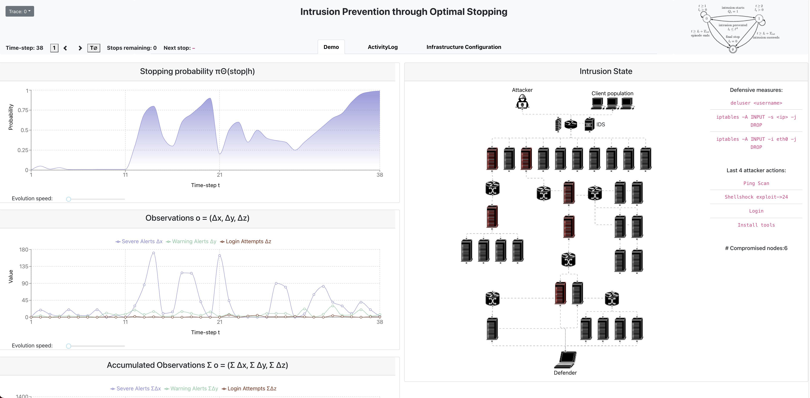
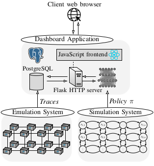

# A dashboard for inspecting and validating intrusion prevention policies

We present a dashboard for inspecting and validating automated intrusion prevention policies. The dashboard allows a user to inspect the evolution an IT infrastructure's state and the actions made by an intrusion prevention policy. To demonstrate the dashboard, we emulate network intrusions by different attackers and use it to dynamically inspect the behavior of intrusion prevention policies at different stages of the intrusions. The policies are obtained through a novel reinforcement learning approach that includes two systems: a simulation system where defender policies are incrementally learned and an emulation system where statistics are produced that drive simulation runs. Through our demonstration, we show that the dashboard provides insight into policy-structure and facilitates a quick way to validate the behavior of policies.

## Intrusion Prevention through Optimal Stopping

A webapp demonstrating automated intrusion prevention through optimal stopping

## Architecture

## Author & Maintainer

Kim Hammar <kimham@kth.se>

## Copyright and license

[LICENSE](./LICENSE.md)

Creative Commons

(C) 2022, Kim Hammar